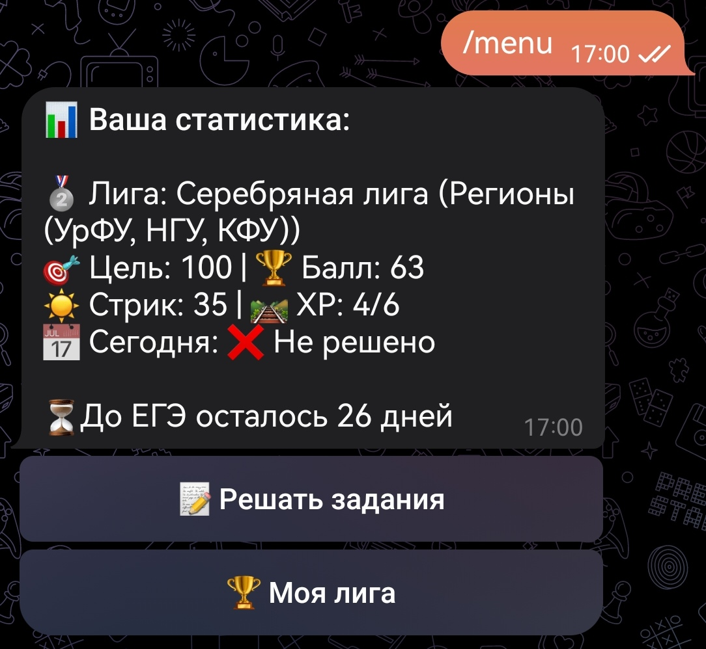
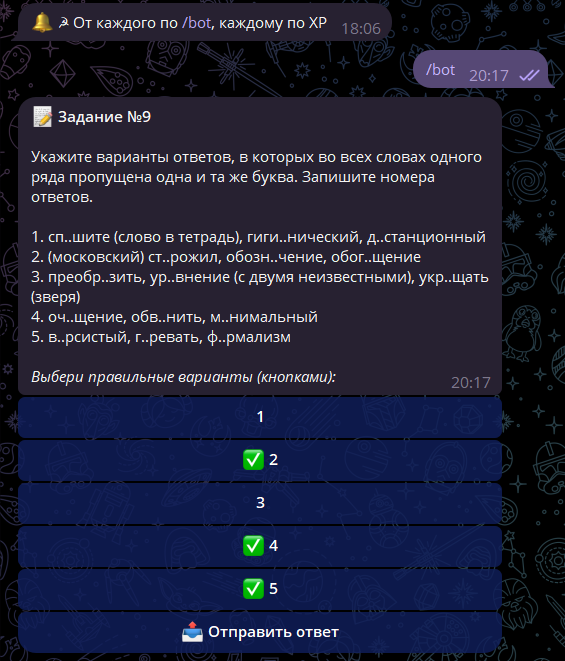

# 🦉 ЕГЭДНЕВНО
Бот для подготовки к ЕГЭ по русскому языку с механикой Duolingo. Подготовка, которую невозможно бросить.
## 📝 Описание проекта
Проект решает главную проблему подготовки к экзаменам — отсутствие системы и быструю потерю мотивации. Вместо долгих часов бота в последние недели перед экзаменом бот предлагает короткие ежедневные сессии. Это превращает учебу в полезную привычку и не дает мозгу «перегореть».

Бот доступен уже сейчас:
- [TG-версия](https://t.me/EGEDNEVNObot)
- [VK-версия](https://vk.me/club236971012)
### ✨ Ключевые особенности:
- 🔥 **Стрики (Ударный режим):** Счётчик дней непрерывных занятий. Пропустил день — стрик обнулился.
- 🏆 **Лиги и Рейтинги:** Соревновательный элемент между пользователями.
- 🔔 **Умные уведомления:** Напоминания, которые подстраиваются под часовой пояс пользователя.
- 📊 **Прогресс-бар:** Визуализация пути до заветных 100 баллов.
- 🤖 **Разбор ошибок с ИИ:** Интеграция Gemini позволяет понять, где ошибся пользователь за считанные секунды.
### 📝 База заданий
На данный момент в боте доступно 11 из 26 типов заданий. *Все задания взяты с официального банка ФИПИ.*

Доступные номера: 4, 5, 6, 7, 9, 10, 11, 12, 13, 14, 16, 17.

## 🛠 Технический стек
- **Язык**: `Python 3.10+`
- **Библиотеки**:
  -  `aiogram` — основная версия бота в Telegram.
  -  `vk_api` — поддержка VK-версии.
  - `requests` — работа с API нейросети.
  - `loguru` — логгирование.
- **База данных**: `SQLite` (с поддержкой хранения состояния пользователей, их часовых поясов и прогресса).
- **Инфраструктура**: Развертывание на зарубежном VPS сервере.
## 🚀 Планы по развитию
- Изменение архитектуры проекта по принципу Separation of Concerns
- Добавление всех оставшихся типов заданий ЕГЭ по русскому языку
- Создание отдельного приложения для удобства и доступа без интернета
- Поддержка других предметов ЕГЭ (математика, информатика, физика)
---
*Разработано с ❤️ для тех, кто хочет сдать ЕГЭ, не теряя рассудка.*
